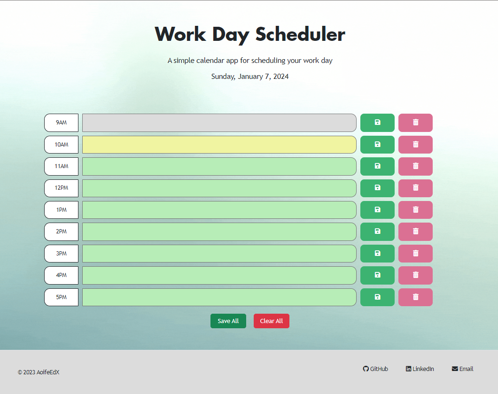

# Third-Party APIs: Work Day Scheduler

## Links

* [Deployed website](https://aoifeedx.github.io/work-day-scheduler/)
* [GitHub repository](https://github.com/AoifeEdX/work-day-scheduler)

## Description

A simple calendar application that allows a user to save events for each hour of the day. This app runs in the browser and features dynamically updated HTML and CSS powered by jQuery, using the [Day.js](https://day.js.org/docs/en/display/format) library to work with date and time.

### Features:
* Displays the current day at the top of the calender when a user opens the planner. 
* Presents time blocks for standard business hours when the user scrolls down. 
* Color-codes each time block based on past, present, and future when the time block is viewed. 
* Allows a user to enter an event when they click a time block.
* Saves the event in local storage when the save button is clicked in that time block.
* Persists events between refreshes of a page.

## Screenshot

## Credits

Instructions and starter code provided by edX (Skills Boot Camp in Front-End Web Development). 
Background image & favicon from Canva. Icons from FontAwesome.

### Resources

The following sites were used for reference:

* Guide on JavaScript elements from [Learn X in Y minutes](https://learnxinyminutes.com/docs/javascript/).
* Guides on working with dates and time from [Day.js](https://day.js.org/docs/en/display/format).
* Guide on showing JavaScript data in HTML from [JavaScript Tutorial](https://www.javascripttutorial.net/javascript-dom/javascript-textcontent/).
* Guide on using JQUERY from [JQUERY User Interface](https://jqueryui.com/).
* Guide on customising HTML from [Bootstrap](https://getbootstrap.com/).
* Guide on adding fonts from [Google Fonts](https://fonts.googleapis.com/).

## License

### MIT License

Copyright (c) 2023 AoifeEdX

Permission is hereby granted, free of charge, to any person obtaining a copy of this software and associated documentation files (the "Software"), to deal in the Software without restriction, including without limitation the rights to use, copy, modify, merge, publish, distribute, sublicense, and/or sell copies of the Software, and to permit persons to whom the Software is furnished to do so, subject to the following conditions:

The above copyright notice and this permission notice shall be included in all copies or substantial portions of the Software.

THE SOFTWARE IS PROVIDED "AS IS", WITHOUT WARRANTY OF ANY KIND, EXPRESS OR IMPLIED, INCLUDING BUT NOT LIMITED TO THE WARRANTIES OF MERCHANTABILITY, FITNESS FOR A PARTICULAR PURPOSE AND NONINFRINGEMENT. IN NO EVENT SHALL THE AUTHORS OR COPYRIGHT HOLDERS BE LIABLE FOR ANY CLAIM, DAMAGES OR OTHER LIABILITY, WHETHER IN AN ACTION OF CONTRACT, TORT OR OTHERWISE, ARISING FROM, OUT OF OR IN CONNECTION WITH THE SOFTWARE OR THE USE OR OTHER DEALINGS IN THE
SOFTWARE.
